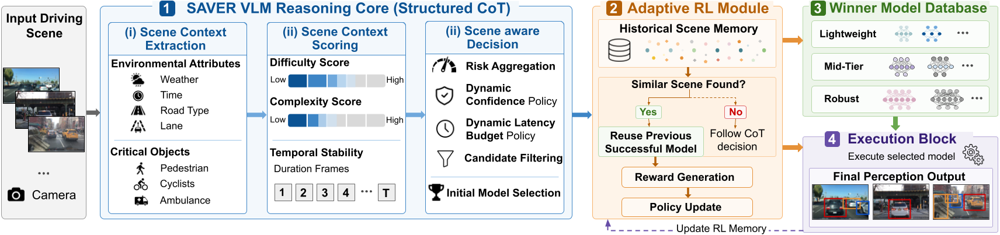

# SAVER: Scene-Aware Vision-Language Reinforcement Learning Framework for Adaptive Perception in SDVs

SAVER is a scene-aware perception orchestration framework for software-defined vehicles (SDVs). Rather than running a single fixed detector, SAVER uses a vision-language model (VLM) with structured chain-of-thought (CoT) reasoning to read each driving scene, estimate its difficulty and complexity, and route perception to the detector best suited to that scene under a risk-aware latency budget — with a lightweight reinforcement learning (RL) memory that stabilizes and corrects the routing decision over time.



## Table of Contents

- [Motivation](#motivation)
- [Architecture](#architecture)
- [Repository structure](#repository-structure)
- [Environment Setup](#environment-setup)
  - [Installation](#installation)
  - [Pre-loading Winner Database Models](#pre-loading-winner-model-database-models)
- [Configuration](#configuration)
- [Usage](#usage)
- [Winner Model Database](#winner-model-database)
- [Reproducing the SAVER Paper Results](#reproducing-the-saver-paper-results)
  - [1. SAVER VLM Chain-of-thought (CoT) Reasoning — Table V](#1-saver-vlm-chain-of-thought-cot-reasoning--table-v)
  - [2. SAVER VLM (CoT) Reasoning + Reinforcement Learning Override Stabilization — Table VII](#2-saver-vlm-cot-reasoning--reinforcement-learning-override-stabilization--table-vii)
  - [3. SAVER Evaluation Performance (Quantitative Metrics) — Table VIII](#3-saver-evaluation-performance-quantitative-metrics--table-viii)
- [Sample Image & Results](#sample-image--results)
- [Citation](#citation)

## Motivation

Across 21 benchmarked automotive perception detectors, accuracy and latency shift substantially with weather, road type, and object density — no single detector, and no single fixed policy, is best across every scene. SAVER answers four questions per frame:

- **Who** should run — which detector.
- **Which** frames get extra latency budget.
- **Why** a decision was made — an auditable, policy-faithful explanation.
- **How** to keep decisions stable across similar scenes over time.

## Architecture

SAVER has four interacting components:

1. **VLM Reasoning Core (structured CoT)** — a three-step pipeline per frame:
   - **Step 1: Scene Context Extraction** — environment attributes (weather, time, road, lane) and critical objects, extracted directly from the frames (image or video frames).
   - **Step 2: Scene Context Scoring** — converts Step 1's output into a difficulty score `D(s)` and a complexity score `C(s)`, and sets the *Adaptive Duration* (how many frames the current model stays active before re-evaluating).
   - **Step 3: Scene-aware Decision** — aggregates `D`/`C` into a risk factor `R`, derives a scene-adaptive confidence range `(C_min, C_max)` and latency budget `L_budget`, shortlists feasible candidates from the Winner Model Database, and selects the final model.
2. **Adaptive RL Module** — a Q-memory over scene signatures that reuses a previously successful routing decision for a similar scene, or corrects a one-shot CoT decision that historically underperformed.
3. **Winner Model Database** — offline-profiled accuracy/latency (and, once available, real measured confidence) for a retained subset of detectors spanning one-stage, two-stage, transformer, and hybrid families.
4. **Execution Block** — runs the selected detector and reports real, measured confidence and latency back into the RL reward and the Winner Model Database's learned confidence profile.

<!-- **Two entry points, one shared CoT implementation:**

- `Chain-of-thought.py` — modules 1, 3, 4 (VLM Reasoning Core, Winner Model Database, Execution Block). Step 3's own "Final model" is used unconditionally; no RL. Produces **Table V**.
- `RL_integrated-CoT.py` — imports `Chain-of-thought.py`'s Step 1-3 functions unmodified and adds module 2 (the Adaptive RL Module) on top, so Q-memory can override Step 3's own pick once it has accumulated conflicting evidence for a scene signature. Produces **Table VII**.
- `experiments/evaluate_saver.py` — runs either pipeline over a held-out dataset (weather x road-type x latency-budget tier) to produce the quantitative evaluation in **Table VIII**.

See the paper for full formulation, or the docstrings in `Chain-of-thought.py` / `RL_integrated-CoT.py` for exactly how each step maps to the paper's sections. -->

## Repository structure

```
SAVER/
├── Chain-of-thought.py                          # VLM Reasoning Core Structured Chain of Thought (CoT) only (Steps 1-3, without RL) 
├── RL_integrated-CoT.py                         # Chain-of-thought.py + Adaptive RL Module + execution 
├── vlm.py                                       # Qwen2.5-VL model wrapper 
├── analysis_settings.py                         # difficulty/complexity scoring tables (weather/time/road/lane weights, object priorities)
├── winners_model_DB.py                          # Winner Model Database: offline mAP/latency profiles + learned confidence
├── detector_runner.py                           # Execution Block: loads and runs the selected detector
├── duration_tracker.py                          # Adaptive Duration mechanism (Scene Context Scoring sub-step for REUSE)
├── fine-tuning.py                               # mines results/*.json into a verified (prompt, completion)
├── config.yaml                                  # Hugging Face token / cache configuration
├── requirements.txt                             # Python dependencies
├── detector_checkpoint_overrides.example.json   # template: point a detector at your own local weights
├── winner_model_confidence.example.json         # template: supply real offline-profiled confidence values
├── experiments/
│   ├── evaluate_saver.py                        # Quantitative evaluation from real routed detector executions
│   ├── dataset_loader.py                        # loads a weather x road-type evaluation dataset
│   └── map_utils.py                             # dependency-light COCO-style mAP computation (+ self-test)
├── images/                                      # sample input images 
└── results/                                     # example runs / output frames 
```

## Environment Setup

#### Installation

```bash
git clone https://github.com/<your-username>/SAVER.git
cd SAVER
pip install -r requirements.txt
```

### Pre-loading Winner Model Database Models

Pre-load all models in the Winner Model Database (WMD) to enable immediate detector execution after each routing decision.

- **YOLOv11-L** — [Official Repository](https://github.com/ultralytics/ultralytics)
- **Faster R-CNN** — [Official Repository](https://github.com/jwyang/faster-rcnn.pytorch)
- **Mask R-CNN** — [Official Repository](https://github.com/multimodallearning/pytorch-mask-rcnn)
- **Sparse R-CNN** — [Official Repository](https://github.com/PeizeSun/SparseR-CNN)
- **DETR** — [Official Repository](https://github.com/facebookresearch/detr)
- **Deformable DETR (R50)** — [Official Repository](https://github.com/HDETR/H-Deformable-DETR)
- **RT-DETR-L** — [Official Repository](https://github.com/lyuwenyu/RT-DETR)
- **DINO** — [Official Repository](https://github.com/IDEA-Research/DINO)

Optionally, check what's installed and preload every detector's weights ahead of time:

```bash
python detector_runner.py               # environment report: what's installed, what's missing
python detector_runner.py --preload      # download/cache every registered backend's weights
```

## Configuration

`config.yaml` is tracked with blank defaults and works out of the box. Set your Hugging Face token as an environment variable rather than committing it:

```bash
export HUGGINGFACE_HUB_TOKEN=hf_...
```

To use your own downloaded checkpoints instead of the automatic torchvision/HF-Hub/ultralytics download, or to supply real offline-profiled confidence values, copy the two `*.example.json` templates:

```bash
cp detector_checkpoint_overrides.example.json detector_checkpoint_overrides.json
cp winner_model_confidence.example.json winner_model_confidence.json
```

Both are gitignored, so your local values never get committed.

## Usage

Both scripts below share the same CLI flags (`Chain-of-thought.py` do not integrate Q-memory or `rl_memory.json`). 

### Chain-of-thought.py — Steps 1-3 (Structured CoT)

Run Steps 1-3 on a single frame, Step 3's own "Final model" used unconditionally:

```bash
python Chain-of-thought.py --image <image-name.jpg> --model qwen2.5-7b --config config.yaml --out results/CoT-<image-name>-decision.json --new-sequence
```

### RL_integrated-CoT.py — Steps 1-3 + Adaptive RL Module

Run the full pipeline on a single frame:

```bash
python RL_integrated-CoT.py --image <image-name.jpg> --model qwen2.5-7b --config config.yaml --out CoT-<image-name>-decision.json

```

Run a sequence of frames from the same clip (lets the Adaptive Duration mechanism reuse a model across similar consecutive frames instead of re-deciding every frame, and lets Q-memory accumulate evidence across the sequence):

```bash
python RL_integrated-CoT.py --image frame_001.jpg --model qwen2.5-7b --config config.yaml --out CoT-frame_001.jpg-decision.json --new-sequence

python RL_integrated-CoT.py --image frame_002.jpg --model qwen2.5-7b --config config.yaml --out CoT-frame_002.jpg-decision.json

python RL_integrated-CoT.py --image frame_003.jpg --model qwen2.5-7b --config config.yaml --out CoT-frame_003.jpg-decision.json

```

Useful flags (identical on both scripts):

| Flag | Default | Description |
|---|---|---|
| `--image` | *(required)* | Path to the front-view driving images |
| `--model` | `qwen2.5-7b` | `qwen2.5-7b` or `qwen2.5-72b` |
| `--config` | `config.yaml` | Path to the config file |
| `--out` | `scene_desc_analysis.json` | Where to write the full CoT decision trace |
| `--frames-dir` | `output_frames/` | Where to save the executed detector's annotated frame |
| `--new-sequence` | off | Start a new frame sequence (resets Adaptive Duration state) |
| `--duration-min-frames` / `--duration-max-frames` | `1` / `10` | Bounds for the Adaptive Duration formula |

Each run prints the full CoT reasoning trace (plus, for `RL_integrated-CoT.py`, the RL memory's decision) and saves an annotated output frame under `output_frames/`.

## Winner Model Database

SAVER routes among eight retained detectors, profiled offline across five weather conditions and two road types:

| Model | Family |
|---|---|
| YOLOv11-Large | One-stage |
| Faster-RCNN | Two-stage |
| Mask-RCNN | Two-stage |
| Sparse-RCNN | Hybrid |
| DETR | Transformer |
| Deformable DETR (R50) | Transformer |
| RT-DETR-L | Transformer |
| DINO | Transformer |

## Reproducing the SAVER Paper Results

This section maps each experiment script to the corresponding results reported in the SAVER paper. All evaluation commands should be executed from the repository root.

### 1. SAVER VLM Chain-of-thought (CoT) Reasoning — Table V

Table V presents an illustrative example of SAVER's three-step reasoning pipeline:

1. **Scene Context Extraction**
2. **Scene Context Scoring**
3. **Scene-Aware Decision**

To generate the SAVER reasoning output for a driving scene, run:

```bash id="10e5zr"
python Chain-of-thought.py \
    --image images/<image-name.jpg> \
    --model qwen2.5-7b \
    --config config.yaml \
    --out results/CoT-<image-name>-decision.json \
    --new-sequence
```

#### Output

The command generates:

```text id="nyfka0"
results/CoT-<image-name>-decision.json
```

The output JSON records the complete SAVER decision process, including:

```text id="b4yb7d"
step1_scene_context_extraction
    ├── weather
    ├── time
    ├── road type
    ├── lane
    └── critical objects

step2_scene_context_scoring
    ├── scene difficulty score
    └── critical-object complexity score

step3_scene_aware_decision
    ├── scene risk
    ├── confidence requirement
    ├── latency budget
    ├── shortlisted detectors
    └── VLM(CoT)-selected detector
```

These JSON fields provide the raw scene analysis, scoring, routing, and execution outputs by CoT used to construct the qualitative end-to-end SAVER reasoning example reported in **Table V** of the paper.

### 2. SAVER VLM (CoT) Reasoning + Reinforcement Learning Override Stabilization — Table VII

Table VII presents an illustrative example of SAVER's complete three-step reasoning pipeline:

1. **Scene Context Extraction**
2. **Scene Context Scoring**
3. **Scene-Aware Detector Decision**
4. **Adaptive Reinforcement Learning Stabilization**

To generate the SAVER (VLM+RL) reasoning output for a driving scene, run:

```bash id="10e5zr"
python RL_integrated-CoT.py \
    --image images/<image-name.jpg> \
    --model qwen2.5-7b \
    --config config.yaml \
    --out results/RL-CoT-<image-name>-decision.json \
    --new-sequence
```

#### Output

The command generates:

```text id="nyfka0"
results/RL-CoT-<image-name>-decision.json
```

The output JSON records the complete SAVER decision process, including:

```text id="b4yb7d"
step1_scene_context_extraction
    ├── weather
    ├── time
    ├── road type
    ├── lane
    └── critical objects

step2_scene_context_scoring
    ├── scene difficulty score
    └── critical-object complexity score

step3_scene_aware_decision
    ├── scene risk
    ├── confidence requirement
    ├── latency budget
    ├── shortlisted detectors
    ├── VLM-selected detector
    ├── RL-selected detector
    └── execution results
        ├── executed detector
        ├── measured confidence
        └── measured latency
```

These JSON fields provide the raw scene analysis, scoring, routing, and execution outputs by CoT + RL(Q Memory) used to construct the qualitative end-to-end SAVER reasoning example reported in **Table VII** of the paper.

### 3. SAVER Evaluation Performance (Quantitative Metrics) — Table VIII

Table VIII reports the end-to-end quantitative evaluation of SAVER against the Best Static Detector reference, across held-out evaluation sequences (DAWN / nuScenes / Ithaca365), broken out by **weather condition** x **road type** x **latency-budget tier**. Unlike Tables V and VII, which are single-scene qualitative traces, Table VIII is measured from real, routed detector executions aggregated over a whole evaluation dataset — mAP and latency in every cell come from actually running the selected detector and scoring it against ground truth.

#### Preparing the evaluation dataset

Download the held-out evaluation data from the source datasets :

[](https://www.nuscenes.org/nuscenes)
[](https://data.mendeley.com/datasets/766ygrbt8y/3)
[](https://ithaca365.mae.cornell.edu/)

<!-- - **nuScenes** — [https://www.nuscenes.org/nuscenes](https://www.nuscenes.org/nuscenes)
- **DAWN** — [https://data.mendeley.com/datasets/766ygrbt8y/3](https://data.mendeley.com/datasets/766ygrbt8y/3)
- **Ithaca365** — [https://ithaca365.mae.cornell.edu/](https://ithaca365.mae.cornell.edu/) -->

Organize the held-out set the same way it was customized for SAVER : 5 weather groups, each split by road type, for both static images and video sequences.

```text id="tv8ds1"
dataset/
├── Sunny/
│   ├── Highway/
│   │   ├── images/
│   │   │   ├── seq_0001/            # a video clip: one subfolder per sequence
│   │   │   │   ├── 000000.jpg
│   │   │   │   └── 000001.jpg
│   │   │   └── standalone_042.jpg   # a single image == its own sequence
│   │   └── annotations.json
│   └── Downtown/
│       ├── images/
│       └── annotations.json
├── Rainy/{Highway,Downtown}/...
├── Snow/{Highway,Downtown}/...
├── Foggy/{Highway,Downtown}/...
└── Sand/{Highway,Downtown}/...
```

<!-- `annotations.json` maps each image's path (relative to that folder's `images/`) to its ground-truth boxes, `bbox` given as `[x1, y1, x2, y2]` in pixel coordinates:

```json id="tv8ds2"
{
  "categories": ["car", "pedestrian", "cyclist"],
  "annotations": {
    "seq_0001/000000.jpg": [
      {"category": "car", "bbox": [412.0, 218.0, 561.0, 322.0]}
    ],
    "standalone_042.jpg": [
      {"category": "pedestrian", "bbox": [90.0, 140.0, 130.0, 260.0]}
    ]
  }
}
``` -->

<!-- A weather/road-type folder you haven't prepared yet is simply skipped, so a partial dataset still evaluates whatever is present. See `experiments/dataset_loader.py`'s module docstring for the full spec. -->

#### Running the evaluation

Run SAVER using CoT without RL Override (Step 3's own "Final model" used unconditionally):

```bash id="tv8ds3"
python experiments/evaluate_saver.py \
    --dataset dataset \
    --mode vlm \
    --output results/table8_vlm.json
```

Run the complete SAVER VLM+RL pipeline (the Adaptive RL Module routes among Step 3's shortlist per latency tier, and Q-memory updates after each real execution):

```bash id="tv8ds4"
python experiments/evaluate_saver.py \
    --dataset dataset \
    --mode vlm_rl \
    --output results/table8_vlm_rl.json
```

#### Output

The commands generate:

```text id="tv8ds5"
results/table8_vlm.json
results/table8_vlm_rl.json
```

The output JSON records, for every weather/road-type bucket present in the dataset, the real measured mAP/latency at each of Table VIII's latency-budget tiers (Highway: <65/<85/<115ms, Downtown: <145/<225/<325ms):

```text id="tv8ds6"
meta
    ├── dataset path
    ├── mode (vlm | vlm_rl)
    └── latency tiers per road type

results["<weather>/<scene>"]
    └── tiers["<latency-budget tier>"]
        ├── best_static_detector
        │       ├── mAP                (measured, not the offline profile)
        │       ├── latency_ms         (measured)
        │       └── frames_run / frames_skipped
        └── saver_vlm | saver_vlm_rl
                ├── mAP                (measured)
                ├── latency_ms         (measured)
                └── frames_run / frames_skipped
```


## Sample Image & Results

- [`images/b1d0a191-06deb55d.jpg`](images/b1d0a191-06deb55d.jpg) - a sample Snowy downtown image input.

- [`images/foggy-095.jpg`](images/foggy-095.jpg) - a sample Foggy rural image input.

- [`results/CoT-foggy-095-decision.json`](results/CoT-foggy-095-decision.json) — a Foggy/Rural scene Output where the confidence policy and shortlist are unaffected but the latency budget lands in a different RL memory bucket than an earlier,  changing which Q-value the outcome updates.
- [`results/CoT-SAVER-b1d0a191-06deb55d-decision.json`](results/CoT-SAVER-b1d0a191-06deb55d-decision.json) — a Snowy/Downtownn scene output where an Adaptive Duration reuse frame (Step 3 skipped), it flips the RL reward for that step from 0 (failure) to 1 (success), since the detector's real measured latency fit comfortably inside the latency budget.


Across DAWN, Ithaca365, and nuScenes, SAVER's VLM-only routing stays within about 1–3 mAP points of the best per-scene static detector reference under the same latency budgets, and adding the RL memory further reduces that gap to roughly 0.5–2 points while correcting brittle one-shot CoT mistakes.

## Citation

If you use SAVER in your research, please cite:

```bibtex
@article{saver,
  title   = {{SAVER}: Scene-Aware Vision-Language Reinforcement Learning Framework for Adaptive Perception in {SDVs}},
  author  = {Sumaiya and Luo, Yichen and Zhou, Peipei and Lu, Sidi and Dong, Zheng},
  year    = {2026},
  note    = {under review}
}
```
